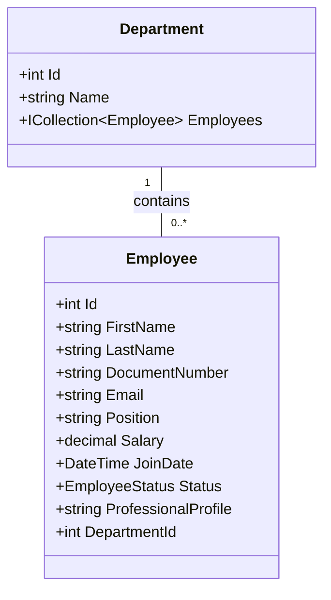

# TalentosPlus S.A.S. - HR Management System

## Overview
**TalentosPlus** is a comprehensive Human Resources Management System built on **.NET 9.0** following **Clean Architecture** principles. It provides a dual-interface solution: a robust Web Portal for administrators to manage talent and analyze data via AI, and a secure REST API for employees to access their profiles.

**Core Technologies**: .NET 9.0, PostgreSQL 17 (Aiven), Docker, Entity Framework Core, Google Gemini AI.

---

## Architecture Diagrams

To clearly visualize the system's structure and workflows, we have included the following UML diagrams.

### 1. System Usage Flow
This flowchart illustrates the high-level interactions between the user, the application layers, and external services.

```mermaid
graph TD
    subgraph Users
        Admin[Administrator]
        Emp[Employee]
    end

    subgraph "Presentation Layer"
        Web[Web MVC Portal]
        API[REST API]
    end

    subgraph "Application Core"
        Services[Business Logic / Services]
        Interfaces[Interfaces & Contracts]
    end

    subgraph "Infrastructure Layer"
        Repos[Repositories (EF Core)]
        ExtServices[External Services]
        Gemini[Google Gemini AI]
        SMTP[Gmail SMTP]
    end

    subgraph "Data Layer"
        DB[(PostgreSQL Database)]
    end

    Admin -->|Manages| Web
    Emp -->|Registers/Queries| API
    
    Web --> Services
    API --> Services
    
    Services --> Repos
    Services --> ExtServices
    
    Repos --> DB
    ExtServices --> Gemini
    ExtServices --> SMTP
```

### 2. Entity Relationship Diagram (ERD)
The system focuses on the relationship between Employees and Departments.



### 3. Use Case Diagram
Detailed breakdown of the available actions for each actor in the system.

```mermaid
usecaseDiagram
    actor "Administrator" as Admin
    actor "Employee" as Emp

    package "TalentosPlus System" {
        usecase "Login (Web)" as  UC1
        usecase "View AI Dashboard" as UC2
        usecase "Query AI (Start Context)" as UC3
        usecase "Manage Employees (CRUD)" as UC4
        usecase "Import Excel" as UC5
        usecase "Download CV (PDF)" as UC6
        
        usecase "Self-Registration" as UC7
        usecase "Login (API JWT)" as UC8
        usecase "View My Profile" as UC9
        usecase "Download My CV" as UC10
    }

    Admin --> UC1
    Admin --> UC2
    Admin --> UC3
    Admin --> UC4
    Admin --> UC5
    Admin --> UC6

    Emp --> UC7
    Emp --> UC8
    Emp --> UC9
    Emp --> UC10
```

---

## Key Features

### For Administrators (Web Portal)
-   **Dashboard with AI**: Visualize stats and ask natural language questions (e.g., *"How many employees earn more than 5000?"*), powered by Google Gemini.
-   **Bulk Import**: Upload an Excel file (`Empleados.xlsx`) to register multiple employees instantly.
-   **Employee Management**: Create, edit, and manage employee records.
-   **PDF Export**: Generate professional "Hoja de Vida" (CV) PDFs for any employee.

### For Employees (REST API)
-   **Auto-Registration**: Public endpoint to register and receive a welcome email.
-   **Secure Access**: JWT-based authentication.
-   **Profile Management**: View personal info and download own CV.

---

## Prerequisites

Before running the application, ensure you have:
-   **Docker Desktop** (or Docker Engine + Compose).
-   **Git** (for cloning the repository).
-   *(Optional)* **.NET SDK 9.0** if you wish to build locally without Docker.

---

## Configuration

Security is paramount. We use environment variables to protect sensitive keys.

1.  **Clone the repository**:
    ```bash
    git clone <repository-url>
    cd TalentosPlus
    ```

2.  **Set up the Environment**:
    Copy the example file to create your local `.env` file:
    ```bash
    cp .env.example .env
    ```

3.  **Update Credentials**:
    Open the `.env` file and fill in your actual credentials:
    ```ini
    # Aiven PostgreSQL Connection
    POSTGRES_HOST=your-host.aivencloud.com
    POSTGRES_PORT=18609
    POSTGRES_DB=defaultdb
    POSTGRES_USER=avnadmin
    POSTGRES_PASSWORD=your_password

    # Google Gemini AI Key
    GEMINI_API_KEY=your_google_ai_key

    # Email (Gmail SMTP)
    SMTP_EMAIL=your_email@gmail.com
    SMTP_PASSWORD=your_app_password
    ```

---

## Running the Application

### Option 1: Docker Compose (Recommended)
This method builds both the Web and API projects and connects them to the remote database.

```bash
docker compose up --build
```

Access the services at:
-   **Web Portal**: [http://localhost:8080](http://localhost:8080)
-   **REST API**: [http://localhost:8081](http://localhost:8081)

### Option 2: Local .NET CLI
If you prefer running it natively on your machine:

1.  **Web Project**:
    ```bash
    dotnet run --project TalentosPlus.Web/TalentosPlus.Web.csproj
    ```
2.  **API Project**:
    ```bash
    dotnet run --project TalentosPlus.Api/TalentosPlus.Api.csproj
    ```

---

## API Documentation

The API includes a **Swagger UI** for interactive testing.
Once running, navigate to: **[http://localhost:8081/swagger](http://localhost:8081/swagger)**

### Key Endpoints
| Method | Endpoint | Description | Auth Required |
| :--- | :--- | :--- | :--- |
| `POST` | `/api/employees/register` | Register a new employee | No |
| `POST` | `/api/auth/login` | Login to get JWT | No |
| `GET` | `/api/employees/me` | View your profile | **Yes (Bearer)** |
| `GET` | `/api/employees/me/cv` | Download your CV | **Yes (Bearer)** |

---

## Solution Structure
The solution creates a clear separation of concerns:

-   **`TalentosPlus.Domain`**: Core business entities (`Employee`, `Department`) and Enums.
-   **`TalentosPlus.Application`**: Business rules, DTOs, and Interfaces.
-   **`TalentosPlus.Infrastructure`**: implementation of interfaces (EF Core Repositories, Gemini AI Service, Email Service).
-   **`TalentosPlus.Web`**: MVC Frontend for Admins.
-   **`TalentosPlus.Api`**: REST API for Employees.
